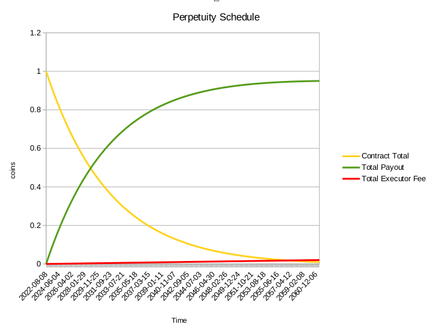
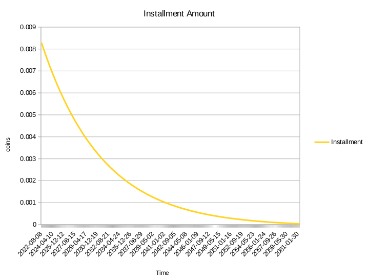

# bitcoin-cash-forever 

A simple on-chain perpetuity contract for bitcoin cash.

## 🐉🐉 pre-alpha release disclaimer 🐉🐉

**This is a brand new contract, using brand new features of bitcoin cash. [2022-06]**

**Please _DO NOT_ load your life savings on it.**

Although the contract strives to keep it simple, [there are significant risks to repeatedly using P2SH addresses, long term.](https://bitcoincashresearch.org/t/p2sh32-a-long-term-solution-for-80-bit-p2sh-collision-attacks/750)

This contract has not undergone any kind of peer-review or security audit. It is just a working concept and is being presented here for a broader audience.

There is absolutely NO way to recover funds if the initial address is incorrect or compromised far into the future.

  🐉 🐉  🐉 🐉  🐉 🐉  🐉 🐉  🐉 🐉  🐉 🐉  🐉 🐉  🐉 🐉

# Introduction

A perpetuity is an annuity, or instrument for regular payments, that has no end. This tool uses a [bitcoin script contract written with CashScript](./perpetuity.cash), to pay some fixed percentage of its total rolling balance, to a predetermined address, at regular intervals, in a manner that can be triggered by any executor that knows, or can infer, the parameters of the contract.

Obviously, there is no such thing as an infinite amount of a fixed-supply currency, luckily it's later than you think. Both for simplicity, and because what we consider "dust" may be spendable on the network in the future as fees are decreased, there is no cutout behavior when the funds near depletion.  

This is an example of the total payout schedule for 1 BCH, paid in 1/120 at a time with a 4000 sat fee.

Starting with one coin, the monthly installments would look something like this:

The ods worksheet to make these graphs is [included in the source repo](./exclude/Worksheet.ods).

# Installing

In your preferred node environment, run your version of:

    npm i bitcoin-cash-forever # -g

# Usage

   A full list of parameters is given with the `-h` flag.

### 1. Creating the contract

To create a new perpetuity with the default parameters, simply provide a receiving address:

    npx bitcoin-cash-forever --address bitcoincash:qrtyy8w9yv6ffqtny9gp56m8kztl3nwwzcqyzsv32k

Which will return the new address for the contract with the balance and info:

    Alpha Software. DON'T PUT YOUR LIFE SAVINGS ON THIS CONTRACT!!! 
    # Perpetuity to pay 1/120 total, every 4000 blocks, after a 3400 (sat) executor allowance
    contract address:           bitcoincash:pz42rjlv3lyxuxz67g33cju6g7my8rm74yphkx9mws
    contract principal:         0

Since the default parameters seem fine, once the contract is funded, it can be spent about once every 4000 blocks or 27.7 days. 

## 2. Executing the Contract

If the funds are spendable, they'll be spent if all the same parameters are passed again.  **Remember to take a liitle something for your troubles** with the `--exAddress` contract as the executor of this contract. 

👇 You can support the tor project by trying the command below. Actually, this is a real contract with real money on it. 👇

👇 No wallet necessary, try to execute this contract 👇

    npx bitcoin-cash-forever --address bitcoincash:qrtyy8w9yv6ffqtny9gp56m8kztl3nwwzcqyzsv32k

🤞  

    Alpha Software. DON'T PUT YOUR LIFE SAVINGS ON THIS CONTRACT!!! 
    # Perpetuity to pay 1/120 total, every 4000 blocks, after a 3400 (sat) executor allowance
    contract address:           bitcoincash:pz42rjlv3lyxuxz67g33cju6g7my8rm74yphkx9mws
    contract principal:         10187408
    installment:              - 84896
    executor fee:             - 3245
    miner fee:                - 152
    =============================================
    next balance:               10099114

## Abusing

When attempting to call the contract before the timelock has expired, an error should be returned.

    Internal Error: Transaction failed with reason: the transaction was rejected by network rules.

    non-BIP68-final (code 64)

with the accompanying [meep debugging](https://github.com/gcash/meep) code:

    meep debug --tx=02000000010564285bb7058b44e7a6efe1a33731921c90f370be25ebb630809d5d2c81acdb000000004c4b017802480d14d6421dc5233494817321501a6b67b097f8cdce1602a00f0376a9147b7e0288ac7e00cd88b27551cd02a914c1a97e01877e88c0c676537a967c78947b9400cc7ba26951cca1a00f000002a04b0100000000001976a914d6421dc5233494817321501a6b67b097f8cdce1688acaa199a000000000017a914aaa1cbec8fc86e185af2231c4b9a47b6438f7ea987955b0b00 --idx=0 --amt=10187408 --pkscript=a914aaa1cbec8fc86e185af2231c4b9a47b6438f7ea987

## Testing

When using the `--testnet` flag, the default parameters are sped up a bit, with the contract paying every block and paying 12.5% of the remaining balance each time.

    # Perpetuity to pay 1/8 total, every 1 blocks, after a 3400 (sat) executor allowance

# Options

    bitcoin-cash-forever -h

    $ bitcoin-cash-forever

    --testnet         Use testnet, defaults to 12.5% payout each block
    --deposit         give the deposit address for the contract and exit
    --address #0      receiving cash address to send coins to, i.e. beneficiary address
    --period #0       how often (in blocks) the contract pays (default: 4000, about monthly)
    --allowance #0    the executor's allowance for miner fees & administration (default: 3400 sats)
    --decay #0        the divisor for the fraction taking in each installment (default: 100, i.e. 1/100 or 1% each installment)
    --exAddress #0    address for fee taken by executor for submitting transaction
    --fee #0          transaction fee override

# Cashscript Contract

    pragma cashscript >= 0.7.0;

    // v20220522

    // This is an experimental perpetuity contract 
    // Although tested, a full audit has not been done
    // DO NOT PUT YOUR LIFE SAVINGS HERE!

    contract Perpetuity(

        // interval for payouts, in blocks
        int period,

        // PKH of the beneficiary, the address receiving payments
        bytes20 recipientPkh,

        // extra allowance for administration of contract
        // fees are paid from executors' allowance. 
        int executorAllowance,

        // divisor for the payout, each payout must be greater than the total
        // amount held on the contract divided by this number
        int decay
    ) {
        function execute() {

            // Check that the first output sends to the recipient
            bytes25 recipientLockingBytecode = new LockingBytecodeP2PKH(recipientPkh);
            require(tx.outputs[0].lockingBytecode == recipientLockingBytecode);

            // Check that time has passed and that time locks are enabled
            require(tx.age >= period);
                
            // require the second output to match the active bytecode
            require(tx.outputs[1].lockingBytecode == new LockingBytecodeP2SH(hash160(this.activeBytecode)));

            // Get the total value on the contract
            int currentValue = tx.inputs[this.activeInputIndex].value;

            // The payout is the current value divided by the decay
            int installment = currentValue/decay;

            // Calculate value returned to the contract
            int returnedValue = currentValue - installment - executorAllowance;

            // Check that the outputs send the correct amounts
            require(tx.outputs[0].value >= installment);
            require(tx.outputs[1].value >= returnedValue);
                
        }

    }